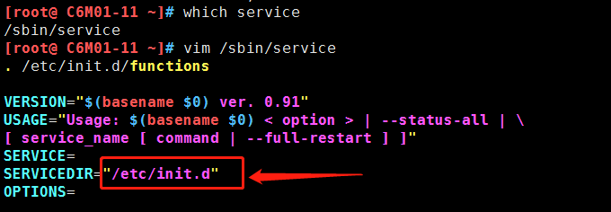
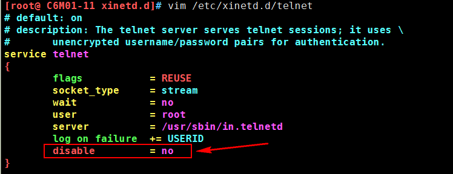
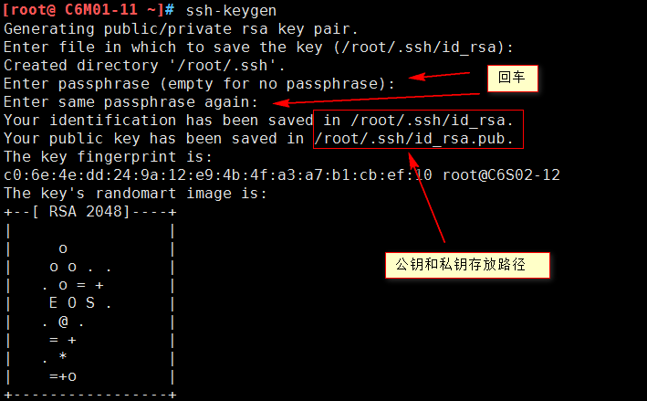

[TOC]


# 第一单元 远程管理


## 第一章 Linux服务分类

### 1.1 系统服务

#### 1.1.1 概念

系统服务（system services）是一种`应用程序类型`。服务一经启动，除非因为关闭系统或管理者手动结束服务，否则都将在`后台执行`。

#### 1.1.2 特点	

- 占用系统资源较多 
- 响应速度较快


### 1.2 临时服务

#### 1.2.1 概念

临时服务平时并不会启动，而是当客户端请求时才会被启动，使用完毕就会结束。 

#### 1.2.2 特点

- 响应速度较慢 
- 节省系统资源


### 1.3 服务管理

为了简化Linux服务管理的麻烦，Linux特别为每一个独立式的服务，提供了一个服务启动程序文件（Service Startup Script）。 所有的服务启动文件被储存在`/etc/rc.d/init.d/`目录下。


`CentOS 6`系统所有的预设服务都可以通过查看`/etc/rc.d/init.d/`目录得到。

```shell
[root@ C6M01-11 ~]# ls -ld /etc/init.d
lrwxrwxrwx. 1 root root 11 6月  30 2018 /etc/init.d -> rc.d/init.d
```

其实`/etc/init.d`是一个符号链接文件，链接指向`/etc/rc.d/init.d`

#### 1.3.1 管理方式

- 利用脚本文件直接管理服务 

```shell
/etc/init.d/服务名 start|stop|restart 
```

- service命令管理方法 

```shell
service 服务名 start|stop|restart 
```

能够使用service命令进行操作的，就是已经注册成为`linux`的系统服务了。


`/etc/init.d/服务名 start`和`service 服务名 start`有何区别？

`service`实际上是调用的`/etc/init.d/`目录下的启动脚本。有图有真相：



#### 1.3.2 开机自启

`chkconfig`命令主要用来更新（启动或停止）和查询系统服务的运行级信息。

谨记`chkconfig`不是立即自动禁止或激活一个服务，而是下次重启系统时生效。

使用`chkconfig`的前提条件必须有供调用的脚本文件(也就是这个服务要是系统服务可以让service调用)。

使用语法：

```
chkconfig --add/--del/--list 系统服务
chkconfig --level <等级代号> 系统服务 on/off/reset
```

示例：

```shell
chkconfig --list
chkconfig --level 3 network off
chkconfig --level 345 network off
chkconfig --del network
chkconfig --add network
```

**查看系统服务在各个级别开机启动情况**	

```shell
[root@ C6M01-11 init.d]# chkconfig
rsyslog        	0:关闭	1:关闭	2:启用	3:启用	4:启用	5:启用	6:关闭
saslauthd      	0:关闭	1:关闭	2:关闭	3:关闭	4:关闭	5:关闭	6:关闭
smartd         	0:关闭	1:关闭	2:关闭	3:关闭	4:关闭	5:关闭	6:关闭
sshd           	0:关闭	1:关闭	2:启用	3:启用	4:启用	5:启用	6:关闭
```

#### 1.3.3 运行级别

简单的说，运行级就是操作系统当前正在运行的功能级别。这个级别从1到6 ，具有不同的功能。

- 0：关机
- 1：单用户模式
- 2：无网络支持的多用户模式
- 3：有网络支持的多用户模式
- 4：保留，未使用
- 5：有网络支持有X-Windows(图形界面)支持的多用户模式
- 6：重新引导系统，即重启


#### 1.3.4 xinetd

`xinetd`是一个特殊的程序，不断监控所有通讯端口。一旦有客户端调用某一个启动文件时，这个程序就要负责启动该服务；而在客户端使用完毕后，该程序也必须要负责结束。 所以通常用来管理临时服务。

**使用`xinetd`启动守护进程**

原则上任何系统服务都可以使用`xinetd`，然而最适合的应该是那些常用的网络服务，因为这些服务的请求数目和频繁程度不会太高。像`DNS`和`Apache`就不适合采用这种方式，而像FTP、Telnet、SSH等就适合使用`xinetd`模式，具体可以查看/etc/services文件。

**守护进程服务位置**

```
/etc/xinetd.d  
```

**管理xinetd** 

```
service xinetd start/stop/restart|status
```


## 第二章 远程管理介绍

### 2.1 基本概念

对于服务器其一般都是放置在我们的`IDC（Internet Data Center，即互联网数据中心)`机房当中，我们通常是无法直接接触到服务器硬件，那么我们如果要对服务器进行操作的话，就只能通过远程管理的方式来对我们的服务器进行控制了。 


### 2.2 常见的远程管理工具 

- 传统的telnet服务器 
- 提供安全连接的ssh服务器--**重要**
- 提供图形界面的`VNC`服务器

#### 2.2.1 telnet

telnet是进行远程登录的标准协议，它是当今Internet上使用最为广泛的协议之一。它把用户正在使用的终端或计算机变成网络某 一远程主机的仿真终端，使得用户可以方便地使用远程主机上的软、硬件资源。 

**缺点**：telnet协议以明文的方式传送所有数据（包括账号和口令），数据在传输过程中很容易被入侵者窃听会篡改，所以建议在对安全性不高的环境下使用。 

**telnet服务端安装** 

```shell
yum -y install  telnet-server
或
rpm -qa telnet-server
```

**telnet服务端配置** 

修改`/etc/xinetd.d/telnet` 文件



1) disable 参数意义: 是否启用服务（no为启用、yes为禁用）
2) only_from 参数意义：允许哪些主机访问
3) no_access 参数意义：拒绝哪些主机访问
4) access_times 参数意义：服务开放时间
**重启`xinetd`服务**

```
/etc/init.d/xinetd restart
```

**查看23端口是否开启**

```
netstat -lntp |grep 23 
```

**telnet客户端连接测试**

此处10.0.0.11为服务端ip

```shell
[root@ C6S02-12 ~]# telnet 10.0.0.11
Trying 10.0.0.11...
Connected to 10.0.0.11.
Escape character is '^]'.
CentOS release 6.8 (Final)
Kernel 2.6.32-642.el6.x86_64 on an x86_64
login: root
Password:
Login incorrect
```

说明：telnet默认不允许root连接，需要将`/etc/securetty`删除或改名。

创建普通用户tom进行测试：

```shell
useradd tom
echo "123456"|passwd --stdin tom
telnet -l tom 10.0.0.21
```


#### 2.2.2 ssh--重点

**（1）什么是SSH？**
简单说，SSH是一种网络协议，用于计算机之间的加密登录。

最早的时候，互联网通信都是明文通信，一旦被截获，内容就暴露无疑。1995年，芬兰学者Tatu Ylonen设计了SSH协议，将登录信息全部加密，成为互联网安全的一个基本解决方案，迅速在全世界获得推广，目前已经成为Linux系统的标准配置。

**（2）SSH连接原理**

ssh服务是一个守护进程(demon)，系统后台监听客户端的连接，ssh服务端的进程名为`sshd`,负责实时监听客户端的请求(IP 22端口)，包括公共秘钥等交换等信息。

ssh服务端由2部分组成： `openssh`(提供ssh服务)    `openssl`(提供加密的程序)

ssh的客户端可以用 `XSHELL`，`Securecrt`, `Mobaxterm`等工具进行连接

**ssh连接排错**
①确认网路通讯是否正常(客户端执行)

```
ping 服务器ip
tracert -d 服务器ip地址(windows下操作)
traceroute -n 服务器ip(linux下操作)
```

②安全机制进行了阻拦

```shell
关闭iptables:  /etc/init.d/iptables stop && chkconfig iptables off
关闭selinux：	setenforce 0 && sed -i 's#SELINUX=.*#SELINUX=disabled#g' /etc/selinux/config
```

③检查ssh进程，确认服务是否运行良好（客户端操作）

```shell
telnet ip 22
namp ip -p 22 （nmap是linux命令）
```

**（3）SSH知识小结**

```shell
SSH是安全的加密协议，用于远程连接Linux服务器
SSH的默认端口是22，安全协议版本是SSH2
SSH服务器端主要包含2个服务功能SSH连接和SFTP服务器
SSH客户端包含ssh连接命令和远程拷贝scp命令等 
```

 **（4）防止SSH登录入侵小结**

    1、用密钥登录并更改默认22端口，尽量不用密码登陆(即使使用也必须使用复杂密码，并定期更换)
    2、牤牛阵法：解决SSH安全问题
       a.防火墙封闭SSH,指定源IP限制(局域网、信任公网)
       b.开启SSH只监听本地内网IP（ListenAddress 172.16.1.61）。
    3、尽量不给服务器外网IP
**（5）安装配置**

**安装：**

```shell
yum -y install openssh openssh-clients openssh-server openssh-askpass 
```

需要安装`OpenSSH `四个安装包：

```shell
openssh-*：包含OpenSSH 服务器及客户端需要的核心文件
openssh-clients-*：OpenSSH 客户端软件包
openssh-server-*：OpenSSH 服务器软件包
openssh-askpass-*：支持对话框窗口的显示，是一个基于X 系统的密码
```

`OpenSSH `配置文件

`OpenSSH `常用配置文件有两个`/etc/ssh/ssh_config` 和`/etc/ssh/sshd_config`。

`ssh_config `为客户端配置文件

`sshd_config `为服务器端配置文件

**配置**

```shell
vim /etc/ssh/sshd_config
Port 22 		#设置端口号
protocol 2,1 	#使用ssh协议的顺序，默认先使用ssh2协议
PermitEmptyPasswords no			#是否允许空密码
PasswordAuthentication yes 		#是否允许密码验证

#加快ssh连接速度
UseDNS no
GSSAPIAuthentication no
```

**（6）ssh服务的启停** 

```shell
service sshd restart|start|stop
或者 
/etc/init.d/sshd restart|start|stop
```

**（7）最基本的用法**

**密码口令登录**

SSH主要用于远程登录。假定你要以用户名user，登录远程主机host，只要一条简单命令就可以了。

```
$ ssh user@host
```

如果本地用户名与远程用户名一致，登录时可以省略用户名。

```
$ ssh host
```

SSH的默认端口是22，也就是说，你的登录请求会送进远程主机的22端口。使用p参数，可以修改这个端口。

```
$ ssh -p 2220 user@host
```

上面这条命令表示，ssh直接连接远程主机的2220端口。

**公钥登录(ssh互信任)**

使用密码登录，每次都必须输入密码，非常麻烦。好在SSH还提供了公钥登录。

公钥登录是为了解决每次登录服务器都要输入密码的问题，流行使用`RSA`加密方案，主要流程包含：

​	1、客户端生成`RSA`公钥和私钥

​	2、客户端将自己的公钥存放到服务器

​	3、客户端请求连接服务器，服务器将一个随机字符串发送给客户端

​	4、客户端根据自己的私钥加密这个随机字符串之后再发送给服务器

​	5、服务器接受到加密后的字符串之后用公钥解密，如果正确就让客户端登录，否则拒绝。这样就不用使用密码了。

这种方法要求用户必须提供自己的公钥。如果没有现成的，可以直接用`ssh-keygen`生成一个：

- 交互式创建和分发秘钥

```
ssh-keygen
```



运行上面的命令以后，系统会出现一系列提示，可以一路回车。其中有一个问题是，要不要对私钥设置口令（`passphrase`），如果担心私钥的安全，这里可以设置一个。
运行结束以后，在$HOME/.ssh/目录下，会新生成两个文件：`id_rsa.pub`和`id_rsa`。前者是你的公钥，后者是你的私钥。 

这时再将公钥传送到远程主机host上面： 

```shell
ssh-copy-id user@host 
```

好了，从此你再登录，就不需要输入密码了。

如果还是不行，就打开远程主机的`/etc/ssh/sshd_config`这个文件，检查下面几行前面"#"注释是否取掉。

```shell
RSAAuthentication yes
PubkeyAuthentication yes
AuthorizedKeysFile .ssh/authorized_keys
```

然后，重启远程主机的ssh服务。

- 非交互式创建和分发秘钥

创建

```shell
ssh-keygen -t dsa -f ~/.ssh/id_dsa -P ""
```

命令说明：
ssh-keygen:生成密钥对命令
-t：指定密钥对的密码加密类型（rsa，dsa两种）
-f：指定密钥对文件的生成路径包含文件名
-P（大写）：指定密钥对的密码

分发

```shell
yum -y install sshpass
sshpass -p "123456" ssh-copy-id -i ~/.ssh/id_dsa.pub "-p 52083 -o StrictHostKeyChecking=no root@10.0.0.12"
```

**（8）scp的使用**

Linux `scp`命令用于Linux之间复制文件和目录。

`scp`是 secure copy的缩写, `scp`是`linux`系统下基于ssh登陆进行安全的远程文件拷贝命令。

```shell
[root@ C6M01-11 ~]# scp --h
usage: scp [-1246BCpqrv] [-c cipher] [-F ssh_config] [-i identity_file]
           [-l limit] [-o ssh_option] [-P port] [-S program]
           [[user@]host1:]file1 ... [[user@]host2:]file2


复制本地文件到远程服务器
[root@ C6M01-11 ~]# scp -P 52083 aaa.txt root@10.0.0.12:/root

拉取远程服务器文件到本地
[root@ C6M01-11 ~]# scp -P 52083  root@10.0.0.12:/root/bbb.txt /root

复制本地目录到远程服务器
scp -r -P 52083 /data/www  root@10.0.0.12:/root

拉取远程服务器目录到本地
scp -r -P 52083  root@10.0.0.12:/data/logs  /root
```

小结：

①`scp`是加密的远程拷贝，而`cp`仅为本地拷贝。

②支持推拉模式

③全量拷贝，效率不高，适合第一次拷贝用，增量拷贝用`rsync`

#### 2.2.3 vnc

`VNC (Virtual Network Console)`是虚拟网络控制台的缩写。优点是支持跨操作系统的远程图形化控制。

**安装:**

```shell
yum -y install tigervnc-server
```

**`vnc`服务的配置：**

```shell
vim /etc/sysconfig/vncservers

# VNCSERVERARGS[2]="-geometry 800x600 -nolisten tcp -localhost"
VNCSERVERS="1:root 2:tom"
```

 vncservers处表示系统登录用户  冒号前面表示端口号， 默认从5900开始， 1表示5901，2表示5902 ，如果是设置其他的端口就要全部写完  例如  8080端口，就是8080：root，**多个用户用空格分开**

vncserverargs配置vnc的参数： 800*600分辨率、-nolisten tcp是否允许多用户连接、-localhost是否允许远程连接

【注意：】VNC`还需要有单独的密码，所以我们要对每个启用`VNC`服务的用户创建单独的`VNC`密码，通过 `vncpasswd `命令必须要切换到该用户才行，否则`VNC`服务启动不起来：

```
su - tom
vncpasswd
```

为root用户设置好单独的`VNC`密码后，启动 `vncserver `并添加开机自启

```shell
vncpasswd
/etc/init.d/vncserver start
chkconfig  vncserver   on
```

**查看vnc进程**

```shell
[root@ c6m01 ~]# ps -ef|grep vnc
root       1291      1  0 09:38 pts/0    00:00:00 /usr/bin/Xvnc :1 -desktop c6m01:1 (root) -auth /root/.Xauthority -geometry 1024x768 -rfbwait 30000 -rfbauth /root/.vnc/passwd -rfbport 5901 -fp catalogue:/etc/X11/fontpath.d -pn
root       1299      1  0 09:38 pts/0    00:00:00 vncconfig -iconic
tom        1325      1  0 09:38 ?        00:00:00 /usr/bin/Xvnc :2 -desktop c6m01:2 (tom) -auth /home/tom/.Xauthority -geometry 1024x768-rfbwait 30000 -rfbauth /home/tom/.vnc/passwd -rfbport 5902 -fp catalogue:/etc/X11/fontpath.d -pn
tom        1333      1  0 09:38 ?        00:00:00 vncconfig -iconic
```

**测试远程连接：**

```shell
#输入命令查看端口号
[tom@ c6m01 ~]$ vncserver -list

TigerVNC server sessions:
X DISPLAY #	PROCESS ID
:1		26324
```


## 第三章 项目

### 3.1 fail2ban防止暴力破解

`fail2ban`可以监视你的系统日志，然后匹配日志的错误信息（正则式匹配）执行相应的屏蔽动作（一般情况下是防火墙），而且可以发送e-mail通知系统管理员！

`fail2ban`运行机制：简单来说其功能就是防止暴力破解。工作的原理是通过分析一定时间内的相关服务日志，将满足动作的相关IP利用`iptables`加入到`dorp`（丢弃）列表一定时间。

`fail2ban `官方网址：http://www.fail2ban.org

**1.安装fail2ban**  

方法一：

```shell
yum install fail2ban -y

fail2ban的配置文件路径：/etc/fail2ban
fail2ban安装目录：/usr/share/fail2ban
日志文件：/var/log/fail2ban.log
达到阈值之后的执行的动作的配置文件：   action.d/ 
包含所有的过滤规则：filter.d/ 
```

方法二：yum安装

```shell
wget  https://github.com/fail2ban/fail2ban/archive/0.10.3.tar.gz
tar -zxvf 0.10.3.tar.gz
cd fail2ban-0.10.3/
python setup.py install
echo $?

生成服务启动脚本并开机自启：
cp files/redhat-initd /etc/init.d/fail2ban
```

**2.配置fail2ban**   

官方的文档写到：

在配置时，我们应该避免修改由`fail2ban`安装创建的文件，我们应该去编写具有.local扩展名的新文件。在`.local`新文件里配置的内容会覆盖`jail.conf`内容里相同的值。

当配置发生改变可以使用  `fail2ban-client reload` ，来重新加载新的配置。

```shell
配置fail2ban
编辑配置文件 jail.local  并实现防暴力破解　
vim /etc/fail2ban/jail.d/jail.local

#defalut这里是设定全局设置，如果下面的监控没有设置就以全局设置的值设置。
[DEFAULT]
# 用于指定哪些地址ip可以忽略 fail2ban 防御,以空格间隔。
ignoreip = 127.0.0.1/8
# 客户端主机被禁止的时长（默认单位为秒）
bantime  = 3600
# 过滤的时长（秒）
findtime  = 600
# 匹配到的阈值（次数）
maxretry = 6


[sshd]
# 是否开启
enabled  = true
# 过滤规则
filter   = sshd
# 动作
action   = iptables[name=SSH, port=ssh, protocol=tcp]
# 日志文件的路径
logpath  = /var/log/secure
# 匹配到的阈值（次数）
maxretry = 3
```

注意：上面的action设置的时候，port=ssh，如果我们更改了sshd服务的端口，需要在这里设置对应的端口号，否则配置不生效。

```shell
/etc/init.d/fail2ban start
```


 注：启动会有关于 python版本导致 模块不能调用错误：

```
ImportError: No module named fail2ban.version
```

是由于更新系统默认python 版本，而 配置自动找寻的是 python 2.6，所以需要重新配置 引导python版本：

```
修改： /usr/bin/fail2ban-server  和  /usr/bin/fail2ban-client
更改 第一行：
#!/usr/bin/python -Es  更改为  #!/usr/bin/python2.6 -Es

sed -i '/python/s#python#python2.6#g' /usr/bin/fail2ban-server
sed -i '/python/s#python#python2.6#g' /usr/bin/fail2ban-client
```

**3.fail2ban的常用命令以及详解**  

 **fail2ban-client** 

| start                       | 启动fail2ban server和监狱                                    |
| --------------------------- | ------------------------------------------------------------ |
| reload                      | 重新加载配置文件                                             |
| stop                        | 暂停fail2ban和监狱                                           |
| status                      | 查看运行的监控服务数量和列表                                 |
| set loglevel                | 设置日志等级，有 CRITICAL, ERROR, WARNING,NOTICE, INFO, DEBUG |
| get loglevel                | 获取当前日志的等级                                           |
| set <JAIL> idle on\|off     | 设置某个监控（监狱）的状态。                                 |
| set <JAIL> addignoreip <IP> | 设置某个监控（监狱）可以忽略的ip                             |
| set <JAIL> delignoreip <IP> | 删除某个监控（监狱）可以忽略的ip                             |
| set <JAIL> banip <IP>       | 将ip加入 **监控（监狱）**                                    |
| set <JAIL> unbanip <IP>     | 将ip从监控（监狱）移除                                       |


### 3.2 rysnc + inotify 实现服务器数据备份

#### 3.2.1 rsync介绍

**（1）概念**

**rsync** - 快速，通用，可实现全量和增量的远程（和本地）文件复制工具。

Rsync是一种快速而非常通用的文件复制工具。它可以通过任何远程shell或远程rsync守护进程从本地复制到另一个主机。它通过仅发送源文件和目的地中的现有文件之间的差异来减少通过网络发送的数据量。Rsync广泛用于备份和镜像以及日常使用的改进的复制命令。

**（2）rsync三种工作模式**

| 本地复制模式：类似于cp                                       |
| ------------------------------------------------------------ |
| Local:  rsync [OPTION...] SRC... [DEST]                      |
| **隧道传输模式： 类似于scp**                                 |
| Access via remote shell:                                     |
| Pull: rsync [OPTION...] [USER@]HOST:SRC... [DEST]            |
| Push: rsync [OPTION...] SRC... [USER@]HOST:DEST              |
| **守护进程模式： 以守护进程（socket）的方式传输数据（rsync  本身的功能）。**最常用 |
| Access via rsync daemon:                                     |
| Pull: rsync [OPTION...] [USER@]HOST::SRC... [DEST]           |
| rsync [OPTION...] rsync://[USER@]HOST[:PORT]/SRC... [DEST]   |
| Push: rsync [OPTION...] SRC... [USER@]HOST::DEST             |
| rsync [OPTION...] SRC... rsync://[USER@]HOST[:PORT]/DEST     |
| 总结：前推后拉记忆隧道和守护进程模式                         |

**（3）rsync的工作场景介绍**

1. 实时同步 inotify+rsync

   用户上传的数据信息，进行实时的备份

2. 定时备份 cron+rsync

   全网数据备份方案（备份 验证 通知）

   备份服务器单点问题（多个服务器 同城灾备 异地灾备）

**（4）参数详解**

| **参数**              | **说明**                                                     |
| --------------------- | ------------------------------------------------------------ |
| -v, --verbose         | 详细模式输出                                                 |
| -a, --archive         | 归档模式，表示以递归方式传输文件，并保持所有文件属性，等于-rlptgoD |
| -z, --compress        | 对备份的文件在传输时进行压缩处理                             |
| -P                    | 显示进度                                                     |
|                       |                                                              |
| -r, --recursive       | 对子目录以递归模式处理                                       |
| -l, --links           | 保留软链结                                                   |
| -p, --perms           | 保持文件权限                                                 |
| -o, --owner           | 保持文件属主信息                                             |
| -g, --group           | 保持文件属组信息                                             |
| -D, --devices         | 保持设备文件信息                                             |
| -t, --times           | 保持文件时间信息                                             |
| -e, --rsh=command     | 指定使用rsh、ssh方式进行数据同步                             |
| --exclude=PATTERN     | 指定排除不需要传输的文件模式                                 |
| --exclude-from=FILE   | 排除FILE中指定模式的文件                                     |
| -S, --sparse          | 对稀疏文件进行特殊处理以节省DST的空间                        |
| --bwlimit=KBPS        | 限制I/O带宽，KBytes per second                               |
| --delete              | 删除那些DST中SRC没有的文件                                   |
| --password-file=FILE  | 从FILE中得到密码                                             |
| -n, --dry-run         | 现实哪些文件将被传输                                         |
| -w, --whole-file      | 拷贝文件，不进行增量检测                                     |
| -B, --block-size=SIZE | 检验算法使用的块尺寸，默认是700字节。                        |
| -x, --one-file-system | 不要跨越文件系统边界                                         |
| -R, --relative        | 使用相对路径信息                                             |
| -b, --backup          | 创建备份，也就是对于目的已经存在有同样的文件名时，将老的文件重新命名为~filename。可以使用--suffix选项来指定不同的备份文件前缀。 |
| -u, --update          | 仅仅进行更新，也就是跳过所有已经存在于DST，并且文件时间晚于要备份的文件，不覆盖更新的文件 |
| -q, --quiet           | 精简输出模式                                                 |
| -c, --checksum        | 打开校验开关，强制对文件传输进行校验                         |

补充参数

```shell
--delete            实现无差异数据同步
--bwlimit=KBPS      实现数据传输过程中限速
--exclude=PATTERN   指定一个文件或目录 --exclude={file1，file2} 可以排除多个无顺序规则文件或目录
--exclude-from=FILE  指定排除多个文件或目录信息，将排除信息写入到一个文件中，利用--exclude-from=排除文件名   类似于tar 打包排除命令
```


**（5）rsync服务端**

安装部署

**服务端部署**
1、确认rsync软件服务是否存在			

```shell
rpm -qa rsync			
```


2、手动配置rsync软件配置文件			

```shell
vim  /etc/rsyncd.conf

##全局配置			
uid = rsync    #用户			
gid = rsync    #用户组			
use chroot = no    #安全相关			
max connections = 200    #最大链接数			
timeout = 300    #超时时间			
pid file = /var/run/rsyncd.pid    #进程对应的进程号文件			
lock file = /var/run/rsync.lock    #锁文件			
log file = /var/log/rsyncd.log    #日志文件，显示出错信息

##模块配置			
[backup]            #模块名称			
path = /data      #模块对应的位置（路径）			
ignore errors       #忽略错误程序			
read only = false    #是否只读			
list = false        #是否可以列表			
hosts allow = 10.0.0.0/24  #准许访问rsync服务器的客户范围			
hosts deny = 0.0.0.0/32      #禁止访问rsync服务器的客户范围			
auth users = rsync_backup    #不存在的用户；只用于认证			
secrets file = /etc/rsync.password  #设置进行连接认证的密匙文件
```

3、创建rsync软件进程用户			

```shell
useradd -s /sbin/nologin -M rsync
```

4、创建rsync备份目录/授权rsync用户管理备份目录；修改备份目录权限			 								

```shell
mkdir -p /data
chown -R rsync.rsync /data/
```

5、创建认证用户密码文件；修改文件权限							

```shell
echo "rsync_backup:123456" >/etc/rsync.password
chmod 600 /etc/rsync.password
```

6、启动rsync守护进程服务			

```shell
rsync --daemon
```

7、将rsync加入开机自启动服务中

```shell
echo "rsync --daemon">>/etc/rc.local
```

**客户端部署**

创建密码文件，客户端密码文件中，只需要密码即可。同时，密码文件的权限是600			

```shell
echo "123456">/etc/rsync.password		
chmod 600 /etc/rsync.password		
```

**客户端测试推送文件**

```shell
rsync -az aaa.txt rsync_backup@10.0.0.21::backup --password-file=/etc/rsync.password
```


>  注意：rsync默认使用873端口，防火墙开启时，需放行端口

**（6）rsync优缺点**
**优点：**
1）可以增量备份，支持socket（daemon），集中备份(支持推拉，都是以客户端为参照物)；socket（daemon）需要加密传输，可以利用vpn服务或ipsec服务。
2）可以限速进行数据的备份或恢复操作。
3）远程SHELL通道模式还可以加密（SSH）传输
**缺点：**
1）大量小文件时进行同步备份，比对的时间较长，有时候会导致rsync进程停止运行或者进程挂起；
解决方法：
a、打包后再同步；
b、drbd（文件系统同步复制block）。
2）同步大文件，比如：10G这样的，有时也会出现问题，导致rsync进程中断，未完整同步前，是隐藏文件，但是会占用磁盘空间（ls -al查看）。直到同步完成后，将隐藏文件改成正常文件。而且，每中断一次，生成一个隐藏文件。

**（7）rsync常见问题排错思路及提示**

```shell
①iptables 防火墙和selinux；
No route to host
② /etc/rsyncd.conf配置文件模块名称书写错误
Unknown module 'backup'  
凡是涉及配置文件的错误必须结构日志文件tail /var/log/rsyncd.log；
③ 权限问题 
   Permission denied
   必须看1. 共享目录的属主和属组是不是rsync；权限是不是755   2.存放密码文件/etc/rsync.password的权限为600和属主为rsync
④ 虚拟用户rsync
  invalid uid rsync    id查看用户 不存在建立用户
⑤ 密码文件问题 /etc/rsync.password 服务端密码文件必须有用户名：密码
   password file must not be other-accessible
```


#### 3.2.2 inotify介绍

**inotify出现的原因**
Rsync（remote sync）远程同步工具，通过rsync可以实现对远程服务器数据的增量备份同步，但rsync自身也有瓶颈，同步数据时，rsync采用核心算法对远程服务器的目标文件进行比对，只进行差异同步。我们可以想象一下，如果服务器的文件数量达到了百万甚至千万量级，那么文件对比将是非常耗时的。而且发生变化的往往是其中很少的一部分，这是非常低效的方式。inotify的出现，可以缓解rsync不足之处，取长补短。

**简介**
Inotify是一种强大的，细粒度的，异步的文件系统事件监控机制（软件），linux内核从2.6.13起，加入了Inotify支持，通过Inotify可以监控文件系统中添加，删除，修改，移动等各种事件，利用这个内核接口，第三方软件就可以监控文件系统下文件的各种变化情况，而inotify-tools正是实施这样监控的软件。还有国人周洋在金山公司开发的sersync。
Inotify实际是一种事件驱动机制，它为应用程序监控文件系统事件提供了实时响应事件的机制，而无须通过诸如cron等的轮询机制来获取事件。cron等机制不仅无法做到实时性，而且消耗大量系统资源。相比之下，inotify基于事件驱动，可以做到对事件处理的实时响应，也没有轮询造成的系统资源消耗，是非常自然的事件通知接口，也与自然世界的事件机制相符合。
inotify 的实现有几款软件

```
1）inotify-tools，
2）sersync（金山周洋）
3）lsyncd
```

由于inotify软件是Linux系统2.6内核开始支持，以前版本不支持，所以，安装前需要检查当前系统是否支持安装inotify软件。

**安装**

```shell
#检查当前系统是否支持
uname -r
2.6.32-642.el6.x86_64
#出现如下3个内容表示当前系统支持安装inotify软件
ls -l /proc/sys/fs/inotify
total 0
-rw-r--r-- 1 root root 0 May 11 20:25 max_queued_events
-rw-r--r-- 1 root root 0 May 11 20:25 max_user_instances
-rw-r--r-- 1 root root 0 May 11 20:25 max_user_watches

yum -y install inotify

# inotifywait：在被监控的文件或目录上等待特定文件系统事件（open、close、delete等）发生，执行后处于阻塞状态，适合在shell脚本中使用； 重点掌握
# inotifywatch：收集被监视的文件系统使用度统计数据，指文件系统事件发生的次数统计
```

**inotify限制文件及优化**

在/proc/sys/fs/inotify目录下有三个文件，对inotify机制有一定的限制：
max_user_watches：设置inotifywait或inotifywatch命令可以监视的文件数量（单进程）；
max_user_instances：设置每个用户可以运行的inotifywait或inotifywatch命令的进程数；
max_queued_events：设置inotify实例事件（event）队列可容纳的事件数量。

简单优化

```shell
echo "50000000" > /proc/sys/fs/inotify/max_user_watches
echo "50000000" >/proc/sys/fs/inotify/max_queued_events 
```

**inotifywait重要参数**

```shell
inotifywait --help

-r|--recursive  # 递归查询目录
-q|--quiet      # 打印很少的信息，仅打印监控事件的信息
-m|--monitor    # 始终保持事件监控状态
-d|--daemon		# daemon模式
--exclude <pattern>		# 排除文件或目录，大小写敏感
--excludei <pattern>	# 排除文件或目录时，不区分大小写
--fromfile <file>	#从文件读取需要监视的文件或排除的文件，一个文件一行，排除的文件以@开头
-o|--outfile <file>	# 输出到文件
-s|--syslog			# 把错误放到日志中而不是标准输出
-q|--quiet			# 安静的
--format <fmt>		# 指定输出格式
             %w 表示发生事件的目录     重要
			 %f 表示发生事件的文件      重要
			 %e 表示发生的事件
			 %Xe 事件以“X”分隔
 			 %T 使用由–timefmt定义的时间格式
--timefmt <fmt>		# 指定时间输出格式
-t|--timeout <seconds>	# 设置超时时间
-e|--event <event1>		# 指定监视的事件，比如删除、增加和修改
```

示例一： **使用-m参数，始终监视开始**


示例二：

生产环境中监控create,close_write,delete事件，close_write相当于修改操作,命令行多个事件之间用 ' , ' 逗号隔开。

```shell
inotifywait -mrq --timefmt '%d%m%y %H:%M' --format '%T %w%f' -e create,close_write,delete /tmp
```


#### 3.2.3 rsync+inotify实时同步

编写同步脚本

```shell
[root@ c6s02 ~]# vim inotify.sh
#!/bin/bash

Path=/data
backup_Server=10.0.0.21

/usr/bin/inotifywait -mrq --format '%w%f' -e create,close_write,delete $Path  | while read line
do
    if [ -f $line ];then
        rsync -az $line --delete rsync_backup@$backup_Server::backup --password-file=/etc/rsync.password
    else
        cd $Path &&\
        rsync -az ./ --delete rsync_backup@$backup_Server::backup --password-file=/etc/rsync.password
    fi
done

#放到后台监控
[root@ c6s02 ~]# nohup sh inotify.sh  &>/dev/null &
[1] 24514
[root@ c6s02 ~]# ps -ef|grep ino
root      24514  24497  0 15:56 pts/1    00:00:00 sh inotify.sh
root      24515  24514  0 15:56 pts/1    00:00:00 /usr/bin/inotifywait -mrq --format %w%f -e create,close_write,delete /data
root      24516  24514  0 15:56 pts/1    00:00:00 sh inotify.sh
root      24518  24497  0 15:56 pts/1    00:00:00 grep --color=auto ino
```

测试结果：


> 注意：rsync的--delete参数，会将客户端的目录无差异同步到服务端，所以一定要注意数据的安全，慎用

既然有了inotify-tools，为什么还要开发sersync？
1）sersync通过配置文件来实现，使用方便；

2）真正的守护进程socket；

3）可以对失败文件定时重传（内置定时任务）；

4）第三方的http接口；

5）默认多线程同步。