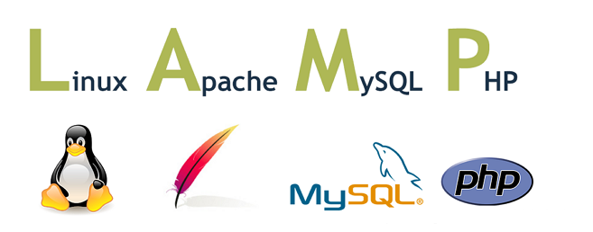
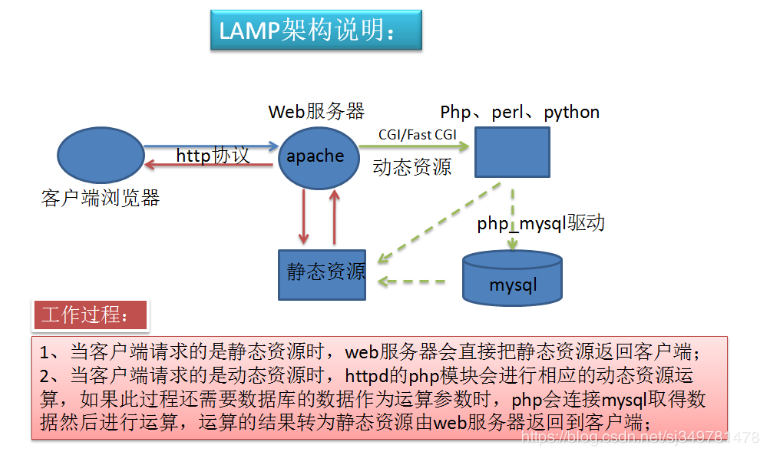
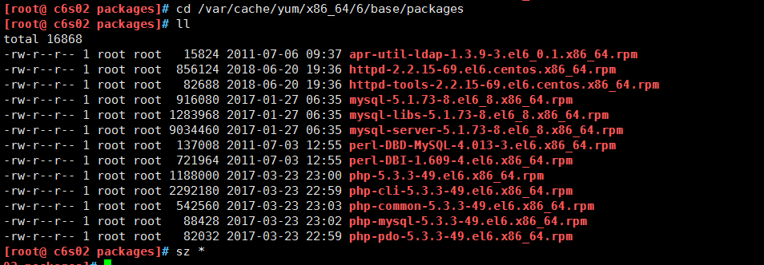

[TOC]


# 第七单元 LAMP（一）	


## 7.1LAMP架构概述

### 7.1.1 LAMP动态网站架构组成

lamp的全称是linux+apache+mysql+php 




### 7.1.2 LAMP组成部分的作用

在LAMP的环境机构中，apache、mysql和php的主要功能分别如下。



    apache主要实现如下功能：
    第一：处理http的请求、构建响应报文等自身服务；
    第二：配置让Apache支持PHP程序的响应（通过PHP模块或FPM）；
    第三：配置Apache具体处理php程序的方法，如通过反向代理将php程序交给fcgi处理。
    
    php主要实现如下功能：
    第一：提供apache的访问接口，即CGI或Fast CGI(FPM);
    第二：提供PHP程序的解释器；
    第三：提供mairadb数据库的连接函数的基本环境。
    
    mysql主要实现如下功能：
    第一：提供PHP程序对数据的存储；
    第二：提供PHP程序对数据的读取(通常情况下从性能的角度考虑，尽量实现数据库的读写分离)。
    
    由此可知，要实现LAMP在配置每一个服务时，安装功能需求进行配置，即可实现LAMP的架构，当然apache、mysql和php服务都可配置为独立服务，安装在不同服务器之上。


## 7.3 RPM包搭建LAMP架构

### 7.2.1 RPM搭建LAMP所需软件包

Centos yum安装保存rpm到本地

1.修改yum配置文件

```shell
sed -i "s/keepcache=0/keepcache=1/g" /etc/yum.conf
```

2.清理yum缓存

```shell
yum clean all
yum makecache
```

3.yum安装

```shell
yum install httpd php php-mysql mysql-server -y
```

4.下载rpm包到本地

```
cd /var/cache/yum/x86_64/6/base/packages
sz *
```




### 7.2.2 开启mysql服务


## 7.4 配置Apache支持php

7.3.1 添加支持php应用

7.3.2 设置默认php主页


## 7.5 创建php测试页面	

7.4.1 编写php测试页面index.php


## 7.6 安装配置Discuz 论坛

7.6.1 上传Discuz的upload文件夹内的文件到网站根目录

7.6.2 浏览器访问安装，接受许可条款

7.6.3 授予涉及的安装文件写权限

7.6.4 连接到数据库，选择网站内容存放数据库

7.6.5 设置后台管理员及密码

7.6.6 修改图片及栏目的方法


## 7.7    SVN服务搭建 +apache实现 基于http访问的svn器及权限管理