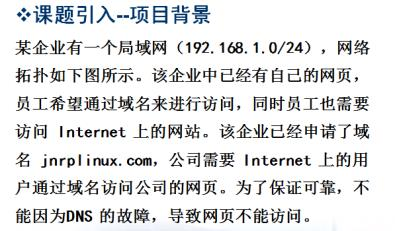
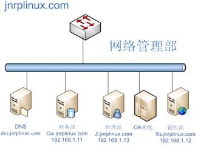
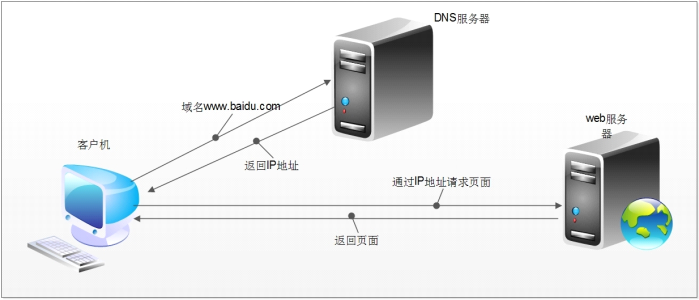
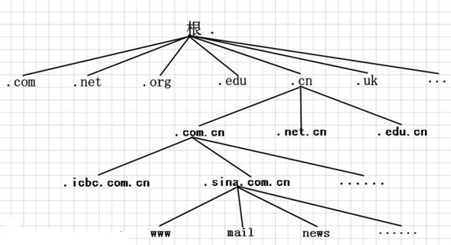
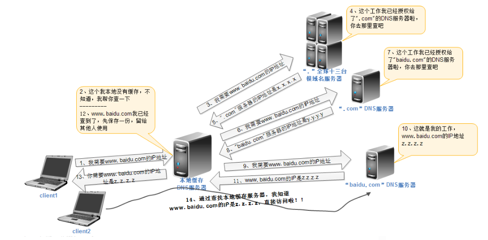
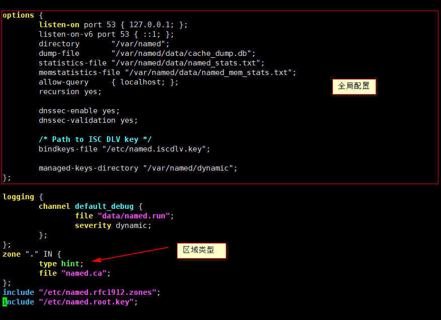

[TOC]


# 第二单元 DNS服务（一）






## 第一章 DNS服务概述

### 1.1 DNS服务概述

#### 1.1.1 简介

DNS 是域名系统 (Domain Name System) 的缩写，是一种组织成**域层次结构**的计算机和网络服务命名系统，它作为可以将域名和 IP 地址相互映射的一个**分布式数据库**，能够使人更方便的访问互联网，而不用去记住能够被机器直接读取的 IP 数串。


简单的概括如下图：



如上图所示，我们客户机需要访问`http://www.baidu.com`这个网站，在浏览器中输入`http://www.baidu.com`后，浏览器首先访问的是DNS服务器，从DNS服务器那里得到`http://www.baidu.com`的IP地址，然后使用IP访问web服务器，从而完成整个通信过程。这里可以清晰的知道，dns的主要工作就是把域名转换成相应的IP地址。这里，域名是不恰当的，通常情况下我们请求的名称称之为`FQDN:Full Qualified Domain Name`,完全合格域名。


#### 1.1.2 DNS服务器分类

1）主域名服务器（primary Name Server）
主域名服务器是特定域所有信息的权威来源，从域管理员构造的本地文件中加载域信息，该文件包含服务器具有的部分域结构的最精确信息。主域名服务器需要配置一组完整的文件。


2）辅助域名服务器（Second Name Server）
辅助域名服务器用来从主域名服务器中转移一整套域信息，它是可选的配置选项。区文件从主域名服务器转移出来，作为磁盘文件保存在辅助域名服务器中。辅助域名服务器不需要配置本地区文件，只需要配置主配置文件(named.conf)，高速缓存初始化文件(named.ca)和回送文件(named.local)。


3）唯高速缓存域名服务器（Cache-only Server）
不包含域名数据库，它每次从某台远程服务器取得域名服务器查询的信息。一旦取得一个回答，就将它放入高速缓存中，下次查询相同的信息就用此回答。


#### 1.1.3 域名层次结构

DNS作为一种基础性的服务，需要相应的请求量是惊人的，为了应对海量数据的情况，便于管理，它采取了分层机构。如下图所示：



通常 Internet 主机域名的一般结构为：主机名.三级域名.二级域名.顶级域名。 

树的每个级别可以表示一个分支或树的叶。 分支是多个名称用于标识命名的资源的集合级别。 叶代表单个名称在该级别上一次用来指示特定的资源。 


**常见 DNS 顶级域名称** 

| DNS 域名称 | 组织类型                   |
| ---------- | -------------------------- |
| com        | 商业公司                   |
| edu        | 教育机构                   |
| net        | 网络 （Internet 的主干网） |
| gov        | 非军事政府机构             |
| org        | 组织、机构                 |

####  1.1.4 DNS原理


  



一次完整的查询请求经过的流程：

Client -->hosts文件 -->DNS Service Local Cache --> DNS Server(recursion) --> Server Cache --> iteration(迭代) --> 根-->顶级域名DNS-->二级域名DNS…


#### 1.1.5 DNS查询类型

**递归查询和迭代查询**


#### 1.1.6 DNS 解析类型

提供域名域主机 IP 地址的对应关系数据库，分为正向解析和反向解析
① 正向解析：将域名解析为对应的 IP,这是 DNS 服务器最基本的功能，也是最常用的功能
② 反向解析：把 IP 解析为对应的域名
邮件服务可能会用到域名反向解析结果实施访问控制策略；若缺少对应的反向解析记录可能会被列入“黑名单”中，导致接收不到邮件！

**常见 DNS 记录类型**

| 记录类型   | 描述                                                         |
| ---------- | ------------------------------------------------------------ |
| SOA 记录   | 域权威记录，说明本机服务器为该域的管理服务器                 |
| NS 记录    | 域名服务器记录                                               |
| A 记录     | 正向解析记录，域名到 IP 地址的映射                           |
| PTR 记录   | 反向解析记录，IP 地址到域名的映射                            |
| CNAME 记录 | 别名记录，可以将注册的不同域名都转到一个域名记录上，由这个域名记录统一解析管理，与A记录不同的是，CNAME别名记录设置的可以是一个域名的描述而不一定是IP地址！ |
| MX 记录    | 邮件记录，指定域内的邮件服务器，需要指定优先级               |


## 第二章 DNS 安装配置

提供 DNS 服务的软件目前主流是美国伯克利加州大学研发的 BIND(Berkeley Internet Name Domain)。该项目出了 BIND 主程序外，在 Linux 平台下还提供了 chroot 与 utils 软件包，bind-chroot 软件包主要功能是让 BIND 软件可以运行在 chroot 默认下，这样 BIND 运行在相对路径的根路径，而不是 Linux 的真正根路径，即使有人对 BIND 软件进行攻击与破坏，影响的也仅仅是系统的一个子目录，不会影响整个操作系统，以此来提高系统的安全性。
另外 **bind-utils 软件包提供了一些 DNS 查询工具，比如 dig、nslookup 等**。


### 2.1 下载安装

```shell
yum -y install bind
/etc/init.d/named start    	#启动
chkconfig named on			#添加开机自启
ss -lntp|grep named			#查看bind端口

# DNS默认使用UDP、TCP协议，使用端口为53（domain），953（mdc，远程控制使用）
bind-chroot 安装bind-chroot软件，将DNS服务锁定在指定的工作目录，安全
bind-utils (安装DNS查询工具软件， 提供nslookup及dig等测试工具，默认桌面版已经安装)
caching-nameserver (安装高速缓存服务器配置文件,建议一定安装)（有的版本不需要）
```


### 2.2 配置详解

Bind配置文件的结构：

| 主程序             | /usr/sbin/named          |
| ------------------ | ------------------------ |
| 主配置文件         | /etc/named.conf          |
| 区域配置文件       | /etc/named.rfc1912.zones |
| zone文件的默认路径 | /var/named               |

**1.DNS主配置文件 /etc/named.conf**
注：options：定义全局配置选项。用于定义BIND服务器的工作目录
注意：在配置时要用“{}”括起来，用“；”结束，并且大括号和分号之间要有空格分开。

**区域类型**：type：用来定义一个区域的类型。

常见的区域类型有3个。

① hint：默认的DNS根的类型为hint型。

② master：指定一个区域为主域名服务器。

③ slave: 指定一个区域为辅助域名服务器。




**2.区域文件：即数据库文件，所在路径 /var/named/chroot/var/named/ **

@：表示当前区域
IN：表示区域类别，即Internet，互联网类型记录。
TTL:用于指定其它服务器将数据在缓存中存放多长时间。86400代表秒，即24h，一般设为1天，最长为7天。
SOA：起始授权记录，用于指出DNS服务器或当前区域的主服务器，固定格式，每个区文件中都必须存在一个唯
一的SOA记录。
SOA后的ns：指区域所授权的主机是ns主机
root: 用于指定root用户邮箱

**2.DNS中zone文件的放置/var/named/*.zone（与named.conf中的zone对应的文件）**

zone文件的书写格式：

```
$TTL 1D                      //用宏定义一个TTL默认值为1天,下面数据直接引用此值.
@                            [TTL]    IN   SOA  主DNS服务器FQDN 管理员邮箱  (
 
    
                                        0       ; 序列号
                                        1D      ; 更新间隔
                                        1H      ; 更新失败后重试间隔
                                        1W      ; 过期时长
                                        3H )    ; 否定记录保存时长
                                                                            
资源类型：A（IPv4）, AAAA（IPv6）：定义FQDN的IP
          NS ：   定义DNS服务器的FQDN
          SOA :   起始授权（每个zone首先要定义此值）
          MX：    定义邮件记录，有优先级概念（0-99），值越小优先级越高。
          CNAME:  定义别名
          PTR：   反向记录
```

### 2.3 单台DNS主服务器应用之正向解析

**1.环境介绍：**

```
10.0.0.21	DNS服务器
10.0.0.22	www.bw.com需要解析到的服务器
```

**2.修改配置文件**

```shell
[root@ c6m01 named]# cat /etc/named.conf

options {
	listen-on port 53 { any; }; 		//修改为any
	listen-on-v6 port 53 { any; };		//修改为any
	directory 	"/var/named";
	dump-file 	"/var/named/data/cache_dump.db";
        statistics-file "/var/named/data/named_stats.txt";
        memstatistics-file "/var/named/data/named_mem_stats.txt";
	allow-query     { any; };			//修改为any
	recursion yes;

	dnssec-enable yes;
	dnssec-validation yes;

	/* Path to ISC DLV key */
	bindkeys-file "/etc/named.iscdlv.key";

	managed-keys-directory "/var/named/dynamic";
};

logging {
        channel default_debug {
                file "data/named.run";
                severity dynamic;
        };
};

zone "." IN {
	type hint;
	file "named.ca";
};

zone "bw.com" IN{                    //定义一个zone，zone的名字“music.com”
 type master;                                   //类型为主服务器
 file "bw.com.zone";             //自定义的域名到IP的正向解析配置
};

include "/etc/named.rfc1912.zones";
include "/etc/named.root.key";
```

**3.创建正向解析文件:**
创建并编辑正向解析文件bw.com.zone(文件名要和name.conf文件中定义的zone file名一致)

```shell
cp -p /var/named/named.localhost /var/named/bw.com.zone

[root@ c6m01 named]# cat /var/named/bw.com.zone
$TTL 1D
@       IN SOA  bw.com. email.com. (
                                        0       ; serial
                                        1D      ; refresh
                                        1H      ; retry
                                        1W      ; expire
                                        3H )    ; minimum
                IN  NS   master
master  IN  A    10.0.0.21
www  IN  A    10.0.0.22
```

**4.检查语法并重载**

```shell
[root@ c6m01 named]# named-checkconf -z
zone bw.com/IN: loaded serial 0
zone localhost.localdomain/IN: loaded serial 0
zone localhost/IN: loaded serial 0
zone 1.0.0.0.0.0.0.0.0.0.0.0.0.0.0.0.0.0.0.0.0.0.0.0.0.0.0.0.0.0.0.0.ip6.arpa/IN: loaded serial 0
zone 1.0.0.127.in-addr.arpa/IN: loaded serial 0
zone 0.in-addr.arpa/IN: loaded serial 0

[root@ c6m01 named]# rndc reload
```

**5.修改本地DNS并测试**

```shell
[root@ c6m01 named]# cat /etc/resolv.conf
nameserver 10.0.0.21
[root@ c6m01 named]# nslookup www.bw.com
Server:		10.0.0.21
Address:	10.0.0.21#53

Name:	www.bw.com
Address: 10.0.0.22
```


### 2.4 单台DNS主服务器应用之CNAME

修改配置文件/var/named/bw.com.zone

```shell
[root@ c6m01 named]# vim bw.com.zone
$TTL 1D
@       IN SOA  bw.com. email.com. (
                                        0       ; serial
                                        1D      ; refresh
                                        1H      ; retry
                                        1W      ; expire
                                        3H )    ; minimum
                IN  NS   master
master  IN  A    10.0.0.21
www     IN  A    10.0.0.22
rg      IN  A    10.0.0.22
ruangong      IN  CNAME    rg
```

测试

```shell
[root@ c6m01 named]# nslookup rg.bw.com
Server:		10.0.0.21
Address:	10.0.0.21#53

Name:	rg.bw.com
Address: 10.0.0.22

[root@ c6m01 named]# nslookup ruangong.bw.com
Server:		10.0.0.21
Address:	10.0.0.21#53

ruangong.bw.com	canonical name = rg.bw.com.
Name:	rg.bw.com
Address: 10.0.0.22
```


## 第三章 域名解析常见命令

DNS的查询指令：host、nslookup、dig

```shell
#安装dig nslookup
yum -y install bind-utils
```

### 3.1 nslookup

nslookup用于查询DNS的记录，查询域名解析是否正常，在网络故障时用来诊断网络问题

**1 直接查询**

```shell
[root@ c6m01 ~]# nslookup www.baidu.com
Server:		223.5.5.5
Address:	223.5.5.5#53

Non-authoritative answer:
www.baidu.com	canonical name = www.a.shifen.com.
Name:	www.a.shifen.com
Address: 61.135.169.125
Name:	www.a.shifen.com
Address: 61.135.169.121
```

**2 查询其他记录**

直接查询返回的是A记录，我们可以指定参数，查询其他记录，比如AAAA、MX等。

```shell
nslookup -type=MX domain [dns-server]
```


其中，type可以是以下这些类型：

A 地址记录
AAAA 地址记录
AFSDB Andrew文件系统数据库服务器记录
ATMA ATM地址记录
CNAME 别名记录
HINFO 硬件配置记录，包括CPU、操作系统信息
ISDN 域名对应的ISDN号码
MB 存放指定邮箱的服务器
MG 邮件组记录
MINFO 邮件组和邮箱的信息记录
MR 改名的邮箱记录
MX 邮件服务器记录
NS 名字服务器记录
PTR 反向记录
RP 负责人记录
RT 路由穿透记录
SRV TCP服务器信息记录
TXT 域名对应的文本信息
X25 域名对应的X.25地址记录

```shell
[root@ c6m01 ~]# nslookup -type=mx baidu.com 8.8.8.8
Server:		8.8.8.8
Address:	8.8.8.8#53

Non-authoritative answer:
baidu.com	mail exchanger = 20 mx1.baidu.com.
baidu.com	mail exchanger = 20 jpmx.baidu.com.
baidu.com	mail exchanger = 20 mx50.baidu.com.
baidu.com	mail exchanger = 10 mx.maillb.baidu.com.
baidu.com	mail exchanger = 15 mx.n.shifen.com.
```

**3 查看DNS缓存记录保存时间-TTL**

ttl -缓存保留的时间,表示DNS记录在DNS服务器上缓存时间。追求解析速度，就把TTL值调大；在近期有计划变更IP地址，就把TTL值调小。

```shell
[root@ c6m01 ~]# nslookup -debug baidu.com 8.8.8.8
Server:		8.8.8.8
Address:	8.8.8.8#53

------------
    QUESTIONS:
	baidu.com, type = A, class = IN
    ANSWERS:
    ->  baidu.com
	internet address = 220.181.38.148
	ttl = 138
    ->  baidu.com
	internet address = 39.156.69.79
	ttl = 138
    AUTHORITY RECORDS:
    ADDITIONAL RECORDS:
------------
Non-authoritative answer:
Name:	baidu.com
Address: 220.181.38.148
Name:	baidu.com
Address: 39.156.69.79
```


### 3.2 dig

dig命令是常用的域名查询工具，可以用来测试域名系统工作是否正常

 dig(选项)(参数)

```
@<服务器地址>：指定进行域名解析的域名服务器；
-b<ip地址>：当主机具有多个IP地址，指定使用本机的哪个IP地址向域名服务器发送域名查询请求；
-f<文件名称>：指定dig以批处理的方式运行，指定的文件中保存着需要批处理查询的DNS任务信息；
-P：指定域名服务器所使用端口号；
-t<类型>：指定要查询的DNS数据类型；
-x<IP地址>：执行逆向域名查询；
```

1.查看域名的A记录

```shell
[root@ c6m01 ~]# dig baidu.com

; <<>> DiG 9.8.2rc1-RedHat-9.8.2-0.68.rc1.el6_10.3 <<>> baidu.com
;; global options: +cmd
;; Got answer:
;; ->>HEADER<<- opcode: QUERY, status: NOERROR, id: 31228
;; flags: qr rd ra; QUERY: 1, ANSWER: 2, AUTHORITY: 0, ADDITIONAL: 0

;; QUESTION SECTION:
;baidu.com.			IN	A

;; ANSWER SECTION:
baidu.com.		351	IN	A	39.156.69.79
baidu.com.		351	IN	A	220.181.38.148

;; Query time: 4 msec
;; SERVER: 223.5.5.5#53(223.5.5.5)
;; WHEN: Tue Aug 27 15:06:01 2019
;; MSG SIZE  rcvd: 59
```

2.查看域名的ip

```
[root@ c6m01 ~]# dig baidu.com +short
220.181.38.148
39.156.69.79
```

3.查看域名的MX 记录

```shell
[root@ c6m01 ~]# dig baidu.com mx

; <<>> DiG 9.8.2rc1-RedHat-9.8.2-0.68.rc1.el6_10.3 <<>> baidu.com mx
;; global options: +cmd
;; Got answer:
;; ->>HEADER<<- opcode: QUERY, status: NOERROR, id: 18100
;; flags: qr rd ra; QUERY: 1, ANSWER: 5, AUTHORITY: 0, ADDITIONAL: 0

;; QUESTION SECTION:
;baidu.com.			IN	MX

;; ANSWER SECTION:
baidu.com.		733	IN	MX	20 jpmx.baidu.com.
baidu.com.		733	IN	MX	20 mx1.baidu.com.
baidu.com.		733	IN	MX	15 mx.n.shifen.com.
baidu.com.		733	IN	MX	10 mx.maillb.baidu.com.
baidu.com.		733	IN	MX	20 mx50.baidu.com.

;; Query time: 43 msec
;; SERVER: 223.5.5.5#53(223.5.5.5)
;; WHEN: Tue Aug 27 15:07:17 2019
;; MSG SIZE  rcvd: 143
```

4.查询域名的TTL记录

```shell
[root@ c6m01 ~]# dig baidu.com ttl

; <<>> DiG 9.8.2rc1-RedHat-9.8.2-0.68.rc1.el6_10.3 <<>> baidu.com ttl
;; global options: +cmd
;; Got answer:
;; ->>HEADER<<- opcode: QUERY, status: NOERROR, id: 4972
;; flags: qr rd ra; QUERY: 1, ANSWER: 2, AUTHORITY: 0, ADDITIONAL: 0

;; QUESTION SECTION:
;baidu.com.			IN	A

;; ANSWER SECTION:
baidu.com.		376	IN	A	220.181.38.148
baidu.com.		376	IN	A	39.156.69.79

;; Query time: 2 msec
;; SERVER: 223.5.5.5#53(223.5.5.5)
;; WHEN: Tue Aug 27 15:07:22 2019
;; MSG SIZE  rcvd: 59

;; Got answer:
;; ->>HEADER<<- opcode: QUERY, status: NXDOMAIN, id: 57063
;; flags: qr rd ra; QUERY: 1, ANSWER: 0, AUTHORITY: 1, ADDITIONAL: 0

;; QUESTION SECTION:
;ttl.				IN	A

;; AUTHORITY SECTION:
.			900	IN	SOA	a.root-servers.net. nstld.verisign-grs.com. 2019082601 1800 900 604800 86400

;; Query time: 212 msec
;; SERVER: 223.5.5.5#53(223.5.5.5)
;; WHEN: Tue Aug 27 15:07:22 2019
;; MSG SIZE  rcvd: 96
```

​	