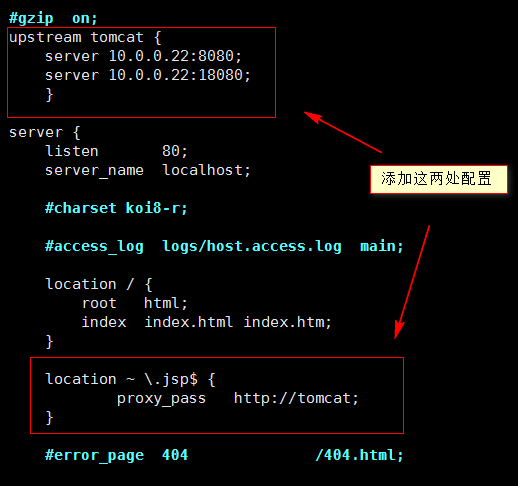
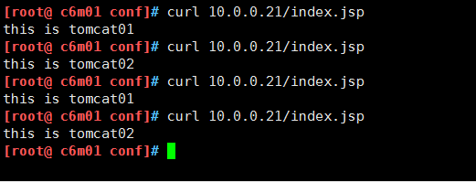

[TOC]


# 第十三单元-Nginx和tomcat整合


## 13.1 项目引入

### 13.1.1 nginx的优点及功能

nginx是一个高性能的HTTP和反向代理服务器，同时也是一个IMAP/POP3/SMTP 代理服务器。它主要有以下优点：

- 高并发连接： 
  官方测试能够支撑5万并发连接，在实际生产环境中跑到2～3万并发连接数。
- 内存消耗少： 
  在3万并发连接下，开启的10个Nginx 进程才消耗150M内（15M*10=150M）。
- 配置文件非常简单： 
  风格跟程序一样通俗易懂。
- 成本低廉： 
  Nginx为开源软件，可以免费使用。而购买F5 BIG-IP、NetScaler等硬件负载均衡交换机则需要十多万至几十万人民币。
- 支持Rewrite重写规则： 
  能够根据域名、URL的不同，将 HTTP 请求分到不同的后端服务器群组。
- 内置的健康检查功能： 
  如果 Nginx Proxy 后端的某台 Web 服务器宕机了，不会影响前端访问。
- 节省带宽： 
  支持 GZIP 压缩，可以添加浏览器本地缓存的 Header 头。
- 稳定性高： 
  用于反向代理，宕机的概率微乎其微


由于nginx的性能很好，因此国内很多大公司都在使用，最主要的原因也是nginx是开源免费的。除了上面描述的一系列功能，项目中主要用nginx来实现以下三个功能：

- 动静分离
- 反向代理
- 负载均衡
- 网页、图片缓存


### 13.1.2 nginx负载均衡主要有以下五种策略

- 轮询（默认） 
  每个请求按时间顺序逐一分配到不同的后端服务器，如果后端服务器down掉，能自动剔除。
- weight 
  指定轮询几率，weight和访问比率成正比，用于后端服务器性能不均的情况。
- ip_hash 
  每个请求按访问ip的hash结果分配，这样每个访客固定访问一个后端服务器，可以解决session的问题。
- fair（第三方） 
  按后端服务器的响应时间来分配请求，响应时间短的优先分配。
- url_hash（第三方） 
  按访问url的hash结果来分配请求，使每个url定向到同一个后端服务器，后端服务器为缓存时比较有效。


## 13.2 安装Nginx

```shell
yum -y install gcc gcc-c++ pcre-devel openssl-devel openssl wget
wget http://nginx.org/download/nginx-1.12.2.tar.gz
tar -zxvf nginx-1.12.2.tar.gz
cd nginx-1.12.2
./configure --prefix=/usr/local/nginx
make
make install
```


## 13.3 安装Tomcat

### 13.3.1 安装jdk环境并测试

```shell
[root@ c6s02 ~]# tail -5 /etc/profile
####java_env####
export JAVA_HOME=/usr/local/jdk1.8.0_60
export PATH=$JAVA_HOME/bin:$JAVA_HOME/jre/bin:$PATH
export CLASSPATH=.$CLASSPATH:$JAVA_HOME/lib:$JAVA_HOME/jre/lib:$JAVA_HOME/lib/tools.jar

source /etc/profile

[root@ c6s02 ~]# java -version
java version "1.8.0_60"
Java(TM) SE Runtime Environment (build 1.8.0_60-b27)
Java HotSpot(TM) 64-Bit Server VM (build 25.60-b23, mixed mode)
```


### 13.3.2 安装tomcat（两个节点）

```shell
tar -zxvf apache-tomcat-7.0.47.tar.gz

#新建tomcat01项目
mkdir -p /opt/tomcat01
cp -a apache-tomcat-7.0.47/* /opt/tomcat01/

#新建tomcat02项目，并修改三处端口为18005,18080,18009
mkdir -p /opt/tomcat021
cp -a apache-tomcat-7.0.47/* /opt/tomcat02/
```

#手动创建测试页并测试

```shell
echo 'this is tomcat01' >/opt/tomcat01/webapps/ROOT/index.jsp
echo 'this is tomcat02' >/opt/tomcat02/webapps/ROOT/index.jsp
curl  10.0.0.22:8080/index.jsp
curl  10.0.0.22:18080/index.jsp
```


## 13.4 通过Nginx和Tomcat结合

安装nginx并修改Nignx配置文件

```shell
vim /usr/local/nginx/conf/nginx.conf
```

在HTTP模块中添加：

```shell
upstream tomcat {     #定义服务器组tomcat
    server 10.0.0.22:8080;    #定义后Tomcat端服务器
    server 10.0.0.22:18080;
}
```

在server模块中添加：

```shell
location ~ \.jsp$ {   #URL正则匹配，匹配jsp结尾的所有URL
	proxy_pass   http://tomcat;   #proxy_pass反向代理参数，将匹配到的请求反向代理到tomcat服务器组！
}
```



**启动nginx并测试**

```shell
/usr/local/nginx/sbin/nginx -t
/usr/local/nginx/sbin/nginx -s stop
/usr/local/nginx/sbin/nginx
```




## 13.5 Tomcat性能优化

### 13.5.1 tomcat内存优化

linux修改TOMCAT_HOME/bin/catalina.sh，在前面加入

```
JAVA_OPTS=" -server -Xms512m -Xmx512m -XX:PermSize=128mM -XX:MaxPermSize=1024m"
```

-server: 一定要作为第一个参数，在多个CPU时性能佳
-Xms：初始Heap堆大小，使用的最小内存,cpu性能高时此值应设的大一些
-Xmx：java heap最大值，使用的最大内存 上面两个值是分配JVM的最小和最大内存，取决于硬件物理内存的大小，建议均设为物理内存的一半。
-XX:PermSize:设定内存的永久保存区域
-XX:MaxPermSize:设定最大内存的永久保存区域


### 13.5.2 tomcat 线程优化

目的：提高并发能力

修改tomcat配置文件server.xml

```
<Connector port="80" protocol="HTTP/1.1" maxThreads="600" minSpareThreads="100" maxSpareThreads="500" acceptCount="700"
connectionTimeout="20000" redirectPort="8443" />
```

maxThreads="600"             #最大线程数
minSpareThreads="100"   #初始化时创建的线程数
maxSpareThreads="500"  #一旦创建的线程超过这个值，Tomcat就会关闭不再需要的socket线程。
acceptCount="700"            #指定当所有可以使用的处理请求的线程数都被使用时，可以放到处理队列中的请求数，超过这个数的请求将不予处理


### 13.5.3 设置session过期时间

conf\web.xml中通过参数指定：

    <session-config>   
        <session-timeout>180</session-timeout>     
    </session-config> 
单位为分钟。