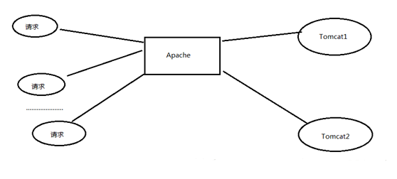

[TOC]


## 第十二单元-Apache+Tomcat


## 12.1项目引入

用Apache作负载均衡器，实现Tomcat服务器的负载均衡。利用Apache收到的网络请求分配到不同的Tomcat服务器上，从而可以增加服务器的带宽和吞吐量，以此来应对网络上用户的并发操作请求。




## 12.2 环境介绍

```
10.0.0.21 httpd	 负载均衡
10.0.0.22 tomcat（两个web站点）
```


## 12.3 apache负载tomcat部署

### 12.3.1 tomcat--(两个web站点)-10.0.0.22

**jdk环境**
**可参考前一天的资料，把jdk环境部署好**

```shell
[root@ c6s02 ~]# tail -5 /etc/profile
####java_env####
export JAVA_HOME=/usr/local/jdk1.8.0_60
export PATH=$JAVA_HOME/bin:$JAVA_HOME/jre/bin:$PATH
export CLASSPATH=.$CLASSPATH:$JAVA_HOME/lib:$JAVA_HOME/jre/lib:$JAVA_HOME/lib/tools.jar

source /etc/profile

[root@ c6s02 ~]# java -version
java version "1.8.0_60"
Java(TM) SE Runtime Environment (build 1.8.0_60-b27)
Java HotSpot(TM) 64-Bit Server VM (build 25.60-b23, mixed mode)
```


### 12.3.2 tomcat部署

解压apache-tomcat-7.0.47.tar.gz

```
tar -zxvf apache-tomcat-7.0.47.tar.gz
```

新建tomcat01项目

```shell
mkdir -p /opt/tomcat01
cp -a apache-tomcat-7.0.47/* /opt/tomcat01/
```

新建tomcat02项目，并修改三处端口为18005,18080,18009

```shell
mkdir -p /opt/tomcat021
cp -a apache-tomcat-7.0.47/* /opt/tomcat02/
```

启动tomcat01和tomcat02，并测试

```shell
启动tomcat01
cd /opt/tomcat01/
./bin/startup.sh

测试tomca01
curl -I 10.0.0.22:8080

启动tomcat02
cd /opt/tomcat02/
./bin/startup.sh

测试tomca02
curl -I 10.0.0.22:18080
```


### 12.3.3 httpd--负载均衡-操作10.0.0.21

1.使用 yum 安装 Apache

```
yum -y install httpd httpd-devel
```

2.安装提供 通过 uri 路径来区分客户端访问页面类型的模块(mod_jk模块也叫连接器)

```
tar -xzvf jakarta-tomcat-connectors-1.2.15-src.tar.gz
cd jakarta-tomcat-connectors-1.2.15-src/jk/native/
yum -y install gcc gcc-c++
./configure --with-apxs=/usr/sbin/apxs
make
make install
```

3.查看 mod_jk.so 是否已经存在（出现以下显示安装成功）

```
[root@ c6m01 conf]# ls /etc/httpd/modules/mod_jk.so
/etc/httpd/modules/mod_jk.so
```

4.生成 mod_jk 的配置文件

```
cd /root/jakarta-tomcat-connectors-1.2.15-src/jk/conf
\cp workers.properties.minimal /etc/httpd/conf/workers.properties
```

5.编辑配置文件 workers.properties

```
#sed -i /^#/d /etc/httpd/conf/workers.properties #删除所有以#开头的行
#sed -i /^$/d /etc/httpd/conf/workers.properties #删除所有空白行
#vim /etc/httpd/conf/workers.properties
```

6.删除 workers.properties 里面用不到的内容，再添加以下内容

```
[root@ c6m01 conf]# cd /etc/httpd/conf/
[root@ c6m01 conf]# vim workers.properties
worker.list=wlb

#Tomcat01
worker.ajp12w.type=ajp13
worker.ajp12w.host=10.0.0.22
worker.ajp12w.port=8009

#Tomcat02
worker.ajp13w.type=ajp13
worker.ajp13w.host=10.0.0.22
worker.ajp13w.port=18009

worker.wlb.type=lb
worker.wlb.balance_workers=ajp12w,ajp13w

worker.jkstatus.type=status

#[root@ c6m01 conf]# vim workers.properties
#worker.list=1706A		#指定一个负载均衡的 worker
#
##Tomcat01	
#worker.tomcat01.type=ajp13		#类型选择 ajp13
#worker.tomcat01.host=10.0.0.22	#tomcat 服务器的 ip
#worker.tomcat01.port=8009		#端口
#worker.tomcat01.lbfactor=1		#这个服务器的权重，配置越高建议值设的高点
#
##tomcat2
#worker.tomcat02.type=ajp13
#worker.tomcat02.host=10.0.0.22
#worker.tomcat02.port=18009
#worker.tomcat02.lbfactor=1
#
#worker.1706A.type=lb
#worker.1706A.balance_workers=tomcat01,tomcat02
```

7.修改 Apache 配置文件

```
vim /etc/httpd/conf/httpd.conf 
在 DirectoryIndex 参数那添加 index.jsp

在配置文件最后一行添加
LoadModule jk_module modules/mod_jk.so #加载 mod_jk.so 模块
JkWorkersFile /etc/httpd/conf/workers.properties #指定 mod_jk 模块的配置文件
JkMount /*.jsp wlb #将所有以.jsp 结尾的请求转发给负载均衡 wlb
```


8.手动创建测试页并测试

```
echo 'this is tomcat01' >/opt/tomcat01/webapps/ROOT/index.jsp
echo 'this is tomcat02' >/opt/tomcat02/webapps/ROOT/index.jsp
curl  10.0.0.22:8080/index.jsp
curl  10.0.0.22:18080/index.jsp
```


9.重启 Apache

```
service httpd restart 
在浏览器访问 http://10.0.0.21:80/index.jsp，如果可以访问到 index.jsp 页面说明整合成
功。
```


## 12.4 apache与tomcat整合的好处和意义有

- Apache处理静态页面的能力要远远高于tomcat，而Tomcat是java应用服务器，两者结合起来，可以更好的发挥各自的长处，实现页面的动静分离处理
- 两者结合可以实现tomcat的负载均衡，有效提高系统的性能，、处理能力和效率 

