[TOC]


# 第十六单元-zabbix


## 16.1 创建主机

### 16.1.1 创建主机前提及步骤

**新增一台服务器10.0.0.42（安装zabbix-agent）**

**1.配置zabbix源**

```shell
rpm -ivh https://mirrors.aliyun.com/zabbix/zabbix/3.5/rhel/7/x86_64/zabbix-release-3.5-1.el7.noarch.rpm
yum clean all
```

**2.安装zabbix-agent**

```shell
yum -y install zabbix-agent
```

**3.修改zabbix-agent配置并重启**

```shell
[root@localhost ~]# egrep -v '^$|^#' /etc/zabbix/zabbix_agentd.conf
PidFile=/var/run/zabbix/zabbix_agentd.pid
LogFile=/var/log/zabbix/zabbix_agentd.log
LogFileSize=0
Server=10.0.0.41		#修改此处为zabbix-server的ip
ServerActive=10.0.0.41	#修改此处为zabbix-server的ip
Hostname=apache			#自己定义，一般和主机名相同
Include=/etc/zabbix/zabbix_agentd.d/*.conf
```


**4.在zabbix-server服务端（10.0.0.41）测试，是否可以获取键值。**

(1) 安装zabbix-get工具

```
yum -y install zabbix-get
```

(2) 通过zabbix_get命令测试键值

```
zabbix_get -s 10.0.0.42 -p 10050 -k "system.cpu.load[all,avg15]"
```

有数值出现，表示zabbix-server监控端可以获取zabbix-agent被监控端的数据，即可通过web界面去添加新增的被监控主机。


**5.在zabbix的web界面添加主机**

configuration（配置）–>Hosts（主机）–>Create host（创建主机）

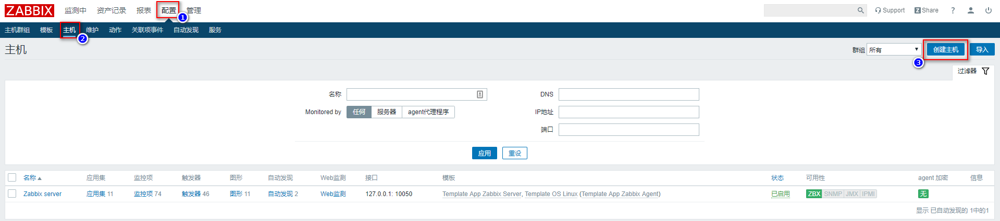


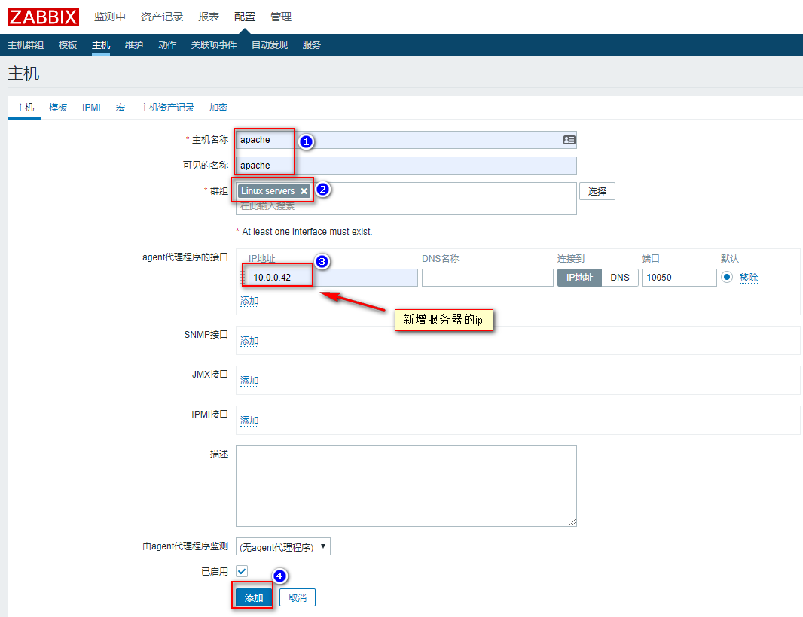


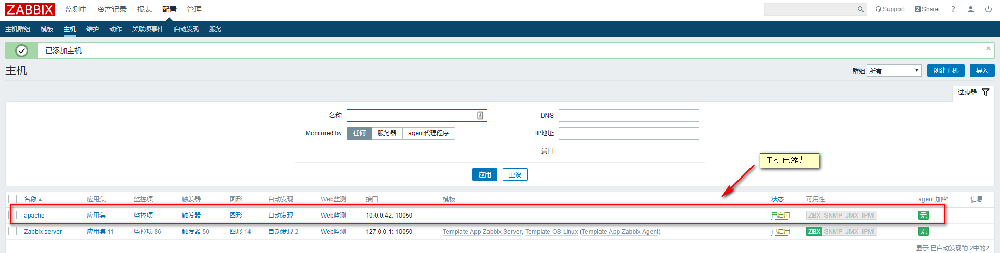


### 16.1.2 为主机链接自定义监控模板


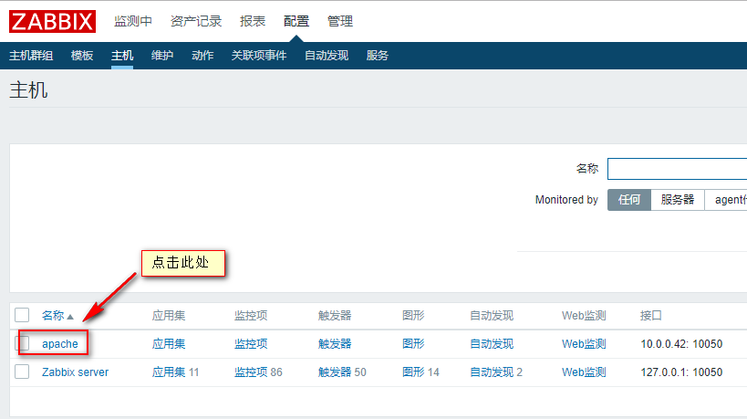

**链接监控模板Template OS Linux**

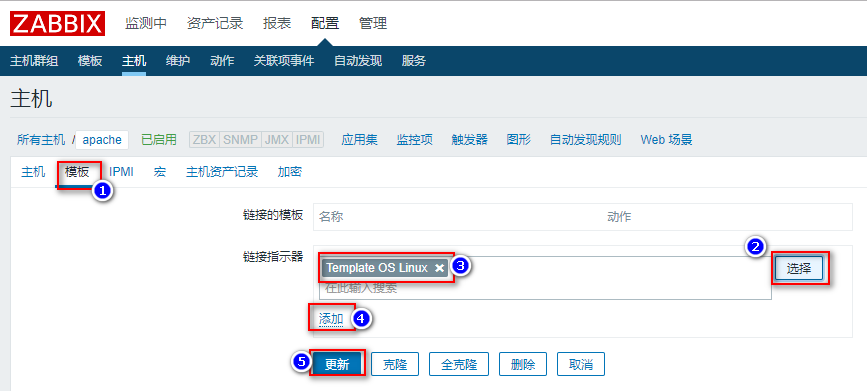

注意：此处一定要点添加后，进行更新，否则模板链接不上。

刷新浏览器，然后等待几十秒，即可看到可用性ZBX变为绿色。

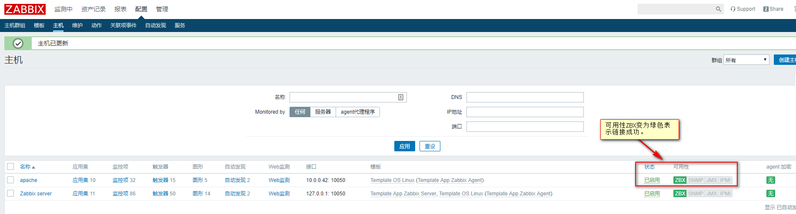


### 16.1.3 为主机添加监控项


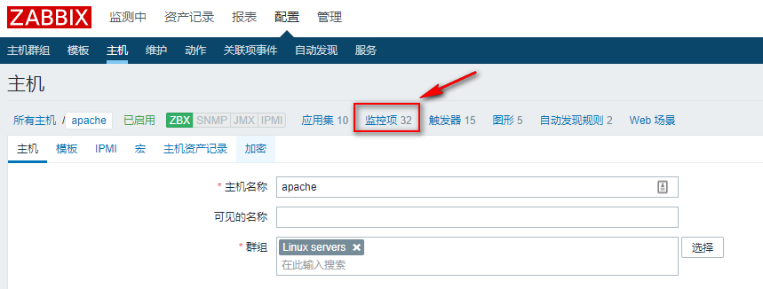


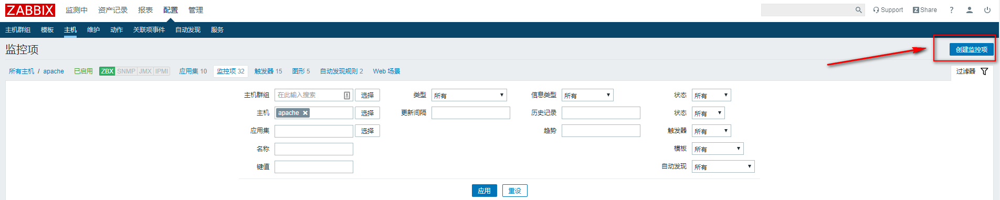


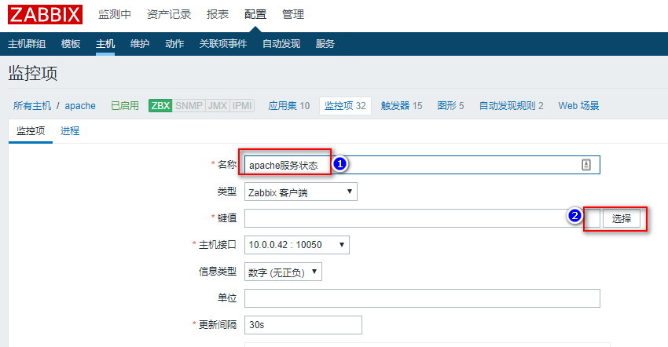

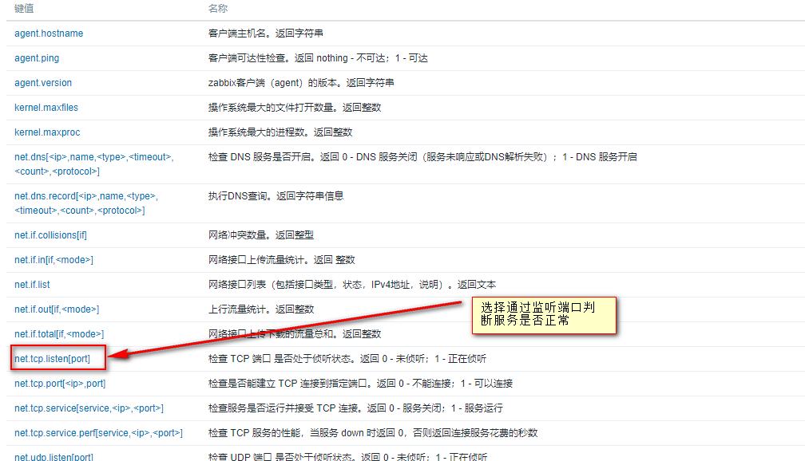

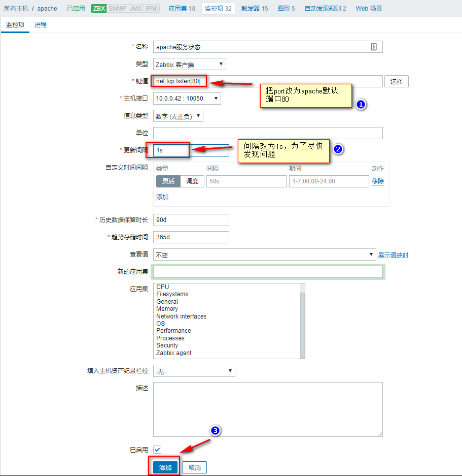

然后通过zabbix-get测试键值是否可以获取到数据，此操作在zabbix-server服务端进行。

```
zabbix_get -s 10.0.0.42 -k net.tcp.listen[80]
0
```

若返回值是1的话，说明Apache端口正在监听
若返回值是0的话，说明Apache端口没有监听


### 16.1.4 为监控项添加触发器

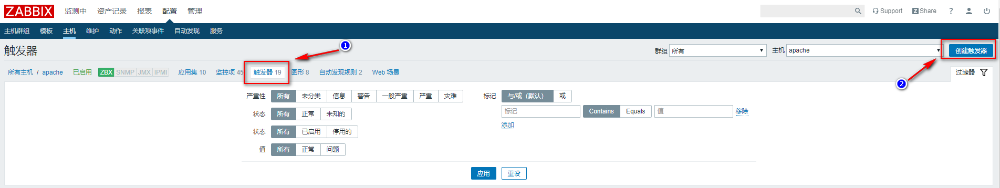

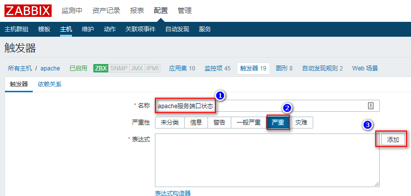


16.1.3为监控项添加图形
16.2为动作添加关联触发器
16.3配置邮件、微信报警
16.4Zabbix 监控cpu，内存
16.5Zabbix 监控MySQL 各项指标
16.6Zabbix 监控pv uv 
16.7Zabbix + Grafana
16.8Openfalcon监控 的安装及使用


