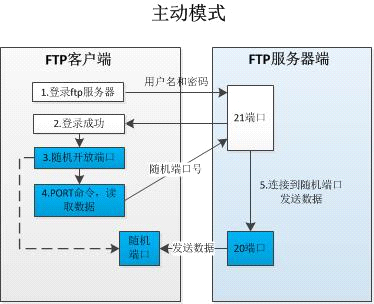
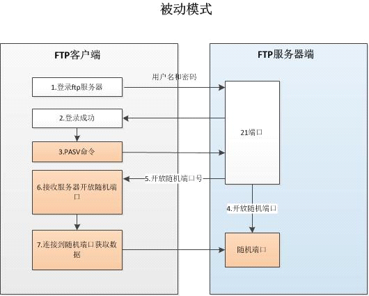
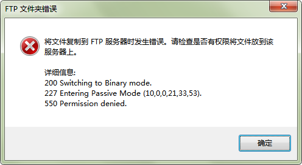
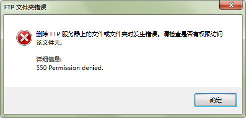

[TOC]


# 第四单元 FTP服务


## 4.1 FTP 服务概述

**FTP** 是`File Transfer Protocol`（**文件传输协议**）的英文简称，它**工作在OSI模型的第七层**，TCP模型的第四层上，即应用层，使用TCP传输而不是UDP，这样FTP客户在和服务器建立连接前就要经过一个被广为熟知的”三次握手”的过程，它带来的意义在于客户与服务器之间的连接是可靠的，而且是面向连接，为数据的传输提供了可靠的保证。

FTP服务使用FTP协议（文件传输协议）来进行**文件的上传和下载**，可以非常方便的进行远距离的文件传输，还支持断点续传功能，可以大幅度地减小CPU和网络带宽的开销，并实现相应的安全控制。


ps:主动模式要求客户端和服务器端同时打开并且监听一个端口以建立连接。在这种情况下，客户端由于安装了防火墙会产生一些问题。所以，创立了被动模式。被动模式只要求服务器端产生一个监听相应端口的进程，这样就可以绕过客户端安装了防火墙的问题。

FTP和NFS、Samba ：三大文件共享服务器。

FTP软件：vsftpd,wu-ftp,proftp等

最常用的FTP服务器架设使用vsftpd软件 ：安全“ very secure”


### 4.1.1 FTP两种工作模式及原理

ftp协议的连接方式有两种，一种是命令连接，一种是数据连接，而ftp的数据连接方式也有两种，一种是主动模式，一种是被动模式。

FTP会话连接时包含了两个通道，一个叫**控制通道，端口号21**；一个叫**数据通道，端口号20**。 

控制通道：控制通道是和FTP服务器进行沟通的通道，连接FTP，发送FTP指令都是通过控制通道来完成的。 

数据通道：数据通道是和FTP服务器进行文件传输或者列表的通道。


FTP协议中，**控制连接均有客户端发起**，而数据连接有两种工作方式：PORT方式和PASV方式

1.FTP的PORT（主动模式）和PASV（被动模式）

(1) PORT（主动模式）

PORT中文称为主动模式，工作的原理： 

FTP客户端连接到FTP服务器的21端口→发送用户名和密码登录，登录成功后要list列表或者读取数据时→客户端随机开放一个端口（1024以上）→发送 PORT命令到FTP服务器，告诉服务器客户端采用**主动模式**并开放端口→FTP服务器收到PORT主动模式命令和端口号后，通过服务器的20端口和客户端开放的端口连接，发送数据，原理如下图：




(2) PASV（被动模式）

PASV是Passive的缩写，中文成为被动模式，工作原理：

FTP客户端连接到FTP服务器的21端口→发送用户名和密码登录，登录成功后要list列表或者读取数据时→发送PASV命令到FTP服务器→ 服务器在本地随机开放一个端口（1024以上）→然后把开放的端口告诉客户端， 客户端再连接到服务器开放的端口进行数据传输，原理如下图：




​	

### 4.1.2 vsftpd软件

#### 4.1.2.1 vsftpd简介

软件：vsftpd

服务名：vsftpd

配置文件：/etc/vsftpd/vsftpd.conf


#### 4.1.2.2 安装vsftpd

```shell
yum install -y vsftpd
/etc/init.d/vsftpd start
chkconfig vsftpd on

# 关闭防火墙和Selinux
service iptables stop
setenforce 0
sed -i '/^SELINUX=/s#SELINUX=.*#SELINUX=disabled#g' /etc/sysconfig/selinux
```


#### 4.1.2.3 配置文件结构

```shell
vsftpd的核心文件和目录：
/etc/pam.d/vsftpd #基于PAM认证的vsftpd验证配置文件
/etc/logrotate.d/vsftpd #日志轮转备份配置文件
/etc/rc.d/init.d/vsftpd #vsftpd启动脚本，供server调用
/etc/vsftpd #vsftpd的主目录
/etc/vsftpd/ftpusers #默认的黑名单
/etc/vsftpd/user_list #指定允许使用vsftpd的用户列表文件
/etc/vsftpd/vsftpd.conf #vsftpd主配置文件
/var/ftp #vsftpd默认共享目录(匿名用户的根目录)
/etc/vsftpd/vsftpd_conf_migrate.sh #是vsftpd操作的一些变量和设置脚本
```

vsftp传输方式默认是PORT模式

```
port_enable=YES|NO
```

**vsftp提供3种远程的登录方式：** 
（1）匿名用户登录方式 
　　就是不需要用户名和密码。就能登录到服务器vsftp（默认只有下载权限）
（2）本地用户方式 
　　需要帐户名和密码才能登录。而且，这个帐户名和密码，都是在你linux系统里面，已经有的用户。 
（3）虚拟用户方式 
　　同样需要用户名和密码才能登录。但是和上面的区别就是，这个用户名和密码，在你linux系统中是没有的(没有该用户帐号)

#### 4.1.2.4 vsftpd默认配置的主要参数

```shell
[root@ c6m01 vsftpd]# cp vsftpd.conf{,.bak}
[root@ c6m01 vsftpd]# egrep -v '^$|^#' vsftpd.conf
anonymous_enable=YES
local_enable=YES
write_enable=YES
cal_umask=022
dirmessage_enable=YES
xferlog_enable=YES
connect_from_port_20=YES
xferlog_std_format=YES
listen=YES
pam_service_name=vsftpd
userlist_enable=YES
tcp_wrappers=YES
```

**测试访问：**

Windows资源管理器输入：ftp://10.0.0.21/


测试上传的权限：



测试删除权限：



**匿名用户权限：默认可以下载但不能上传**


## 4.2 匿名用户常用参数

配置文件中添加如下参数：

```shell
anon_root=/var/ftp				#匿名用户默认共享目录
anon_upload_enable=YES 			#启用匿名用户上传文件的功能（文件夹不成）
anon_mkdir_write_enable=YES 	#开放匿名用户写和创建目录的权限（管理员权限）
anon_other_write_enable=YES 	#默认没有这一项,允许匿名用户具有建立目录，上传之外的权限，如重命名，删除

[root@ c6m01 vsftpd]# cat vsftpd.conf
#匿名用户权限相关
anonymous_enable=YES
anon_root=/var/ftp
anon_upload_enable=YES
anon_mkdir_write_enable=YES
anon_other_write_enable=YES
####
local_enable=YES
write_enable=YES
local_umask=022
dirmessage_enable=YES
xferlog_enable=YES
connect_from_port_20=YES
xferlog_std_format=YES
listen=YES
pam_service_name=vsftpd
userlist_enable=YES
tcp_wrappers=YES

[root@ c6m01 ftp]# /etc/init.d/vsftpd restart
```

#### 4.2.1 测试匿名用户增删改

所在文件夹要有写入权限 例如：`chmod -R o+w /var/pub/ `

匿名用户家目录/var/ftp权限是755，这个权限是不能改变的。


4.4 FTP客户端
4.4.1 Linux下FTP客户端
4.4.2 Windows下FTP客户端
4.4.3 客户端下载和上传文件


4.5 设置本地用户登录FTP
4.5.1 设置SELinux为警告模式
4.5.2 创建FTP本地用户限制不能登录系统


4.6 本地用户默认配置
4.6.1 本地用户默认共享目录
4.6.2 本地用户默认的权限


4.7 FTP限速等参数	
4.7.1 max_clients参数的意义	
4.7.2 local_max_rate参数的意义	
4.7.3 anon_max_rate参数的意义	
4.7.4 max_per_ip 参数的意义

